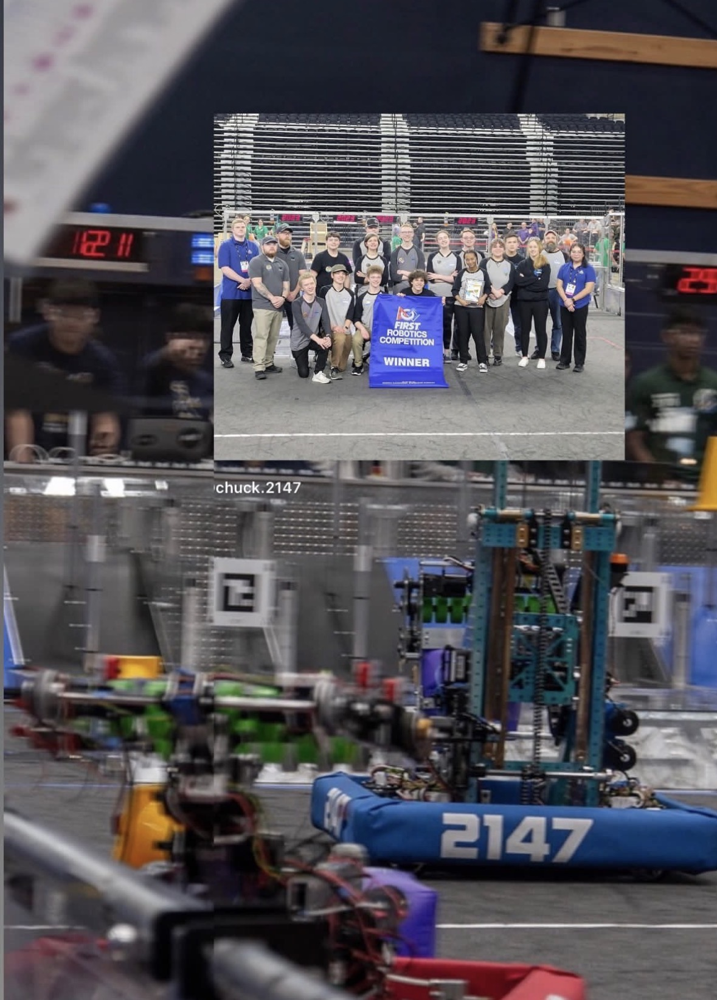
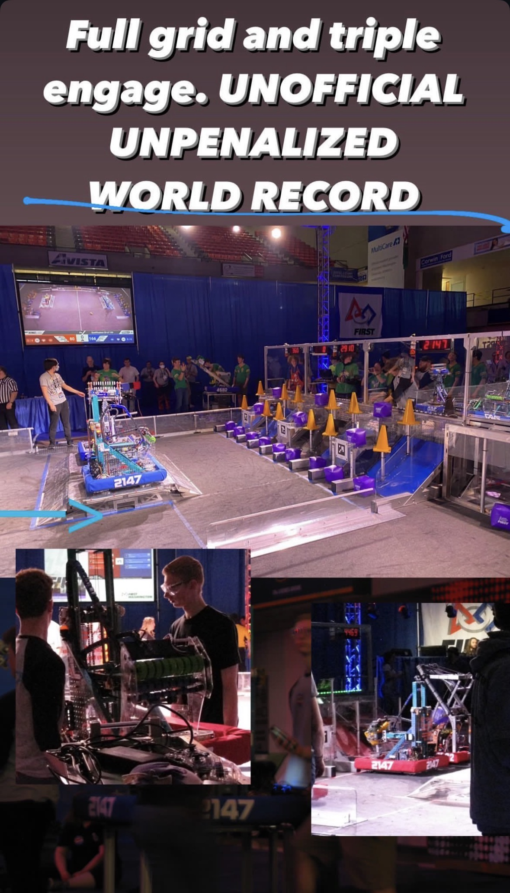
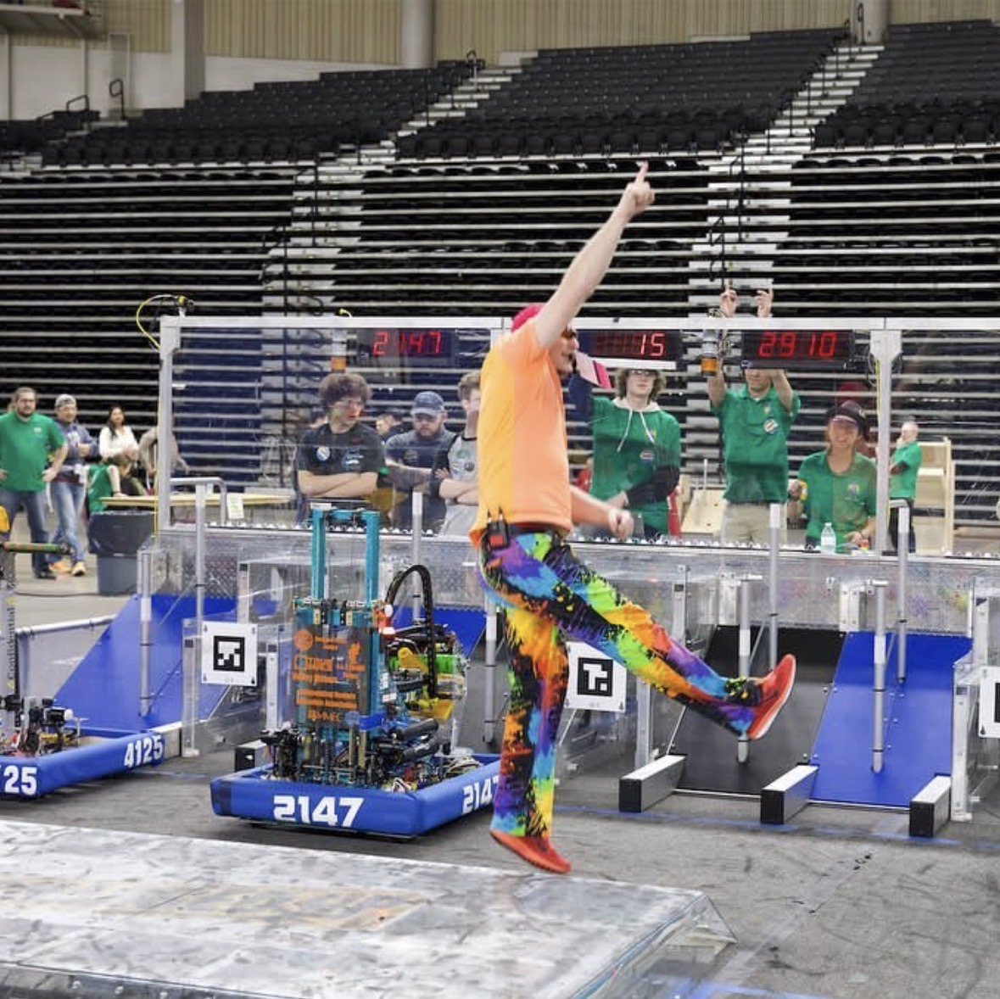
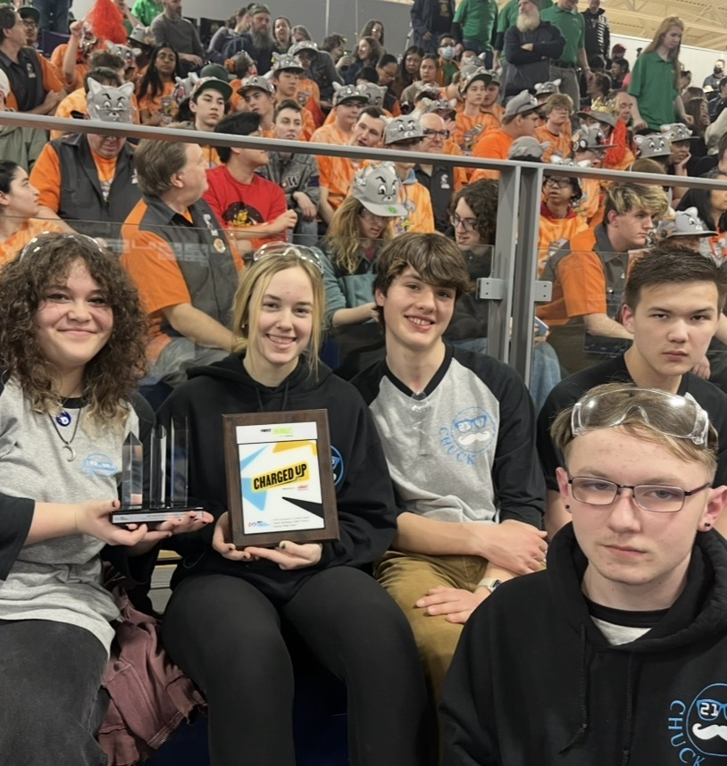
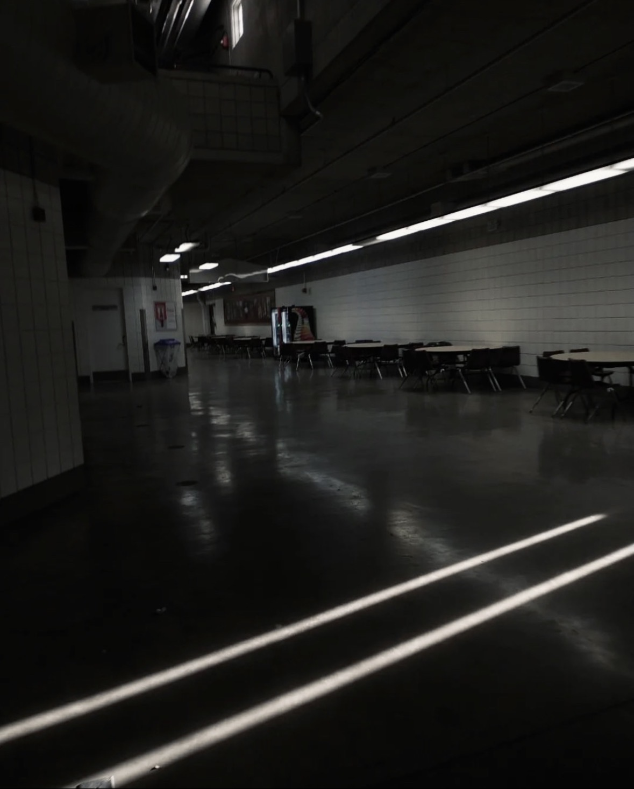

# FRC 2023 — Team 2147 Robot Software


Competition robot software for FIRST Robotics Competition Team 2147 during the 2023 *Charged Up* season. The code coordinates a swerve drivetrain, elevator, telescoping extension, and intake across teleoperated and autonomous play.

For the team's official event record, awards, rankings, and match history, visit [Team 2147 on The Blue Alliance](https://www.thebluealliance.com/team/2147/2023).



## What the robot can do

- Drive field-relative or robot-relative with four independently controlled swerve modules.
- Zero the gyro and reduce drive speed for precision positioning.
- Move the elevator and extension to stowed, intake, human-player, level-two, and level-three positions.
- Run the intake forward or backward for game-piece acquisition and scoring.
- Execute autonomous routines for forward movement, game-piece actions, crossing, turning, and charge-station balancing.
- Publish and tune control values through NetworkTables/Shuffleboard helpers.



## Software architecture

The project uses WPILib's command-based model to separate hardware responsibilities from operator intent.

```text
Robot / RobotContainer
├── controller bindings
├── autonomous chooser
└── commands
    ├── TeleopSwerve ───────→ Swerve
    ├── BalanceCommand ─────→ Swerve + gyro feedback
    ├── TurnToAngleCommand ─→ Swerve heading control
    └── autonomous groups ──→ drivetrain + mechanisms

Subsystems
├── Swerve / SwerveModule
├── ElevatorSubsystem
├── ExtensionSubsystem
└── IntakeSubsystem
```

This boundary makes it possible to reuse mechanism actions in both controller bindings and sequential autonomous routines.

## Driver and operator control

`RobotContainer` is the coordination center. It maps driver axes to translation, strafe, and rotation; binds precision/robot-centric modes; and gives a second operator direct and preset control of the scoring mechanisms. Command groups add explicit waits between intake, elevator, and extension actions so mechanisms move in a deliberate sequence.



## Autonomous strategy

The dashboard chooser offers a primary cone/cross/balance routine plus forward-drive and do-nothing fallbacks. The main autonomous sequence combines manipulator actions with path segments and a balance command, demonstrating how a complicated match opening can be expressed as smaller reusable commands.

The swerve implementation uses CTRE encoders/gyro support, REV motor controllers, odometry, module-state optimization, and PID/feedforward configuration. Vendor dependency manifests are checked in for reproducible WPILib builds.

## Competition outcome

The repository captures more than a classroom exercise: it is software written for a machine operating under time pressure, field constraints, and team coordination. The season included a world-record performance shown in the project photography and an award moment for the team.



The final image also records the scale of the venue and the work that happens outside the spotlight between matches.



## Build and deploy

Requirements:

- WPILib 2023 development environment
- Java toolchain supplied by WPILib
- access to an FRC roboRIO for hardware deployment

Build the project with the included Gradle wrapper:

```bash
./gradlew build
```

Deploy to a configured robot:

```bash
./gradlew deploy
```

Hardware-specific code should be tested with the robot safely disabled, raised, or otherwise secured according to team procedure.

## Repository map

```text
src/main/java/frc/
├── robot/
│   ├── Robot.java                    # WPILib lifecycle
│   ├── RobotContainer.java           # Bindings and autonomous selection
│   ├── Constants.java                # Geometry, IDs, gains, and limits
│   ├── autos/                         # Autonomous command groups
│   ├── commands/                      # Drive, turn, and balance behavior
│   └── subsystems/                    # Swerve, elevator, extension, intake
└── lib/                               # CTRE/REV configuration and swerve math
```

## Skills demonstrated

Real-time control, Java, WPILib, command-based architecture, swerve kinematics and odometry, PID control, CAN devices, autonomous sequencing, operator-interface design, hardware/software integration, and competition debugging.

## License

WPILib components are covered by the included [WPILib license](WPILib-License.md).
